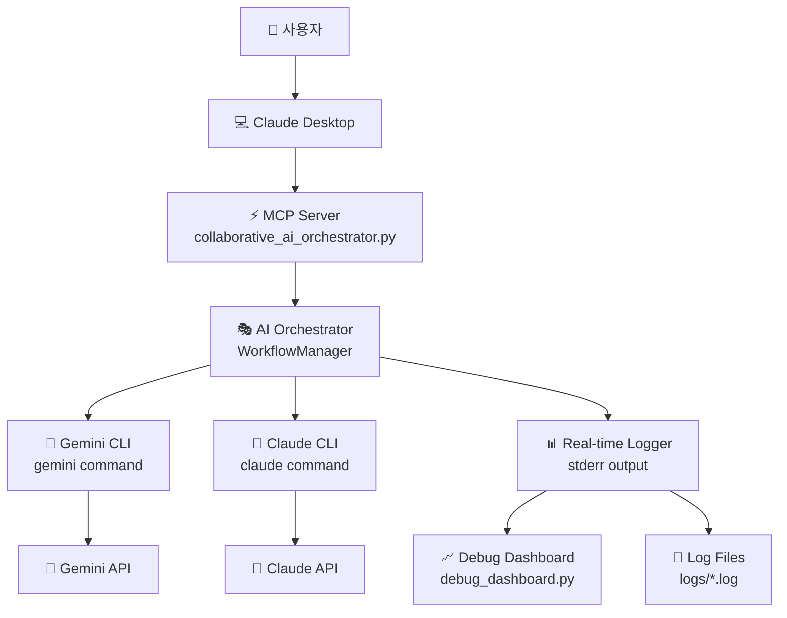

# 🤝 MCP Collaborative AI Server 시스템 구조

## 📊 전체 시스템 아키텍처



## 🔄 6단계 협업 워크플로우

```
📝 1. 초기 토론 (Initial Discussion)
   │
   ├─ Gemini: 작업 분석 및 접근법 제안
   ├─ Claude: Gemini 분석 검토 및 보완
   └─ 결과: 최적 접근법 및 역할 분담 결정
   │
   ↓
✍️ 2. 초안 작성 (Draft Creation)  
   │
   ├─ 토론 결과 기반으로 적합한 AI 선택
   ├─ 선택된 AI가 초안 작성
   └─ 결과: 1차 작업 결과물 생성
   │
   ↓
🔍 3. 동료 검토 (Peer Review)
   │
   ├─ 양쪽 AI가 초안 검토
   ├─ 구체적 개선사항 및 피드백 제공
   └─ 결과: 상세한 검토 의견 및 개선 방향
   │
   ↓
🚀 4. 피드백 개선 (Improvement)
   │
   ├─ 두 AI가 각각 개선안 제시
   ├─ 개선안들을 비교 분석
   └─ 결과: 최적의 개선된 버전 선택
   │
   ↓
✅ 5. 최종 검토 (Final Review)
   │
   ├─ 양쪽 AI의 최종 검토 및 다듬기
   ├─ 요구사항 충족도 재확인
   └─ 결과: 완성도 높은 최종 결과물
   │
   ↓
📊 6. 품질 평가 (Quality Assessment)
   │
   ├─ 두 AI의 독립적 품질 평가 (1-10점)
   ├─ 평가 점수 평균 계산
   └─ 결과: 객관적 품질 점수 및 협업 통계
```

## 🔌 MCP 통신 프로토콜

### JSON-RPC 2.0 메시지 플로우

```
📱 Claude Desktop                🖥️  MCP Server                    🤖 AI Systems
      │                               │                               │
      │ {"method":"tools/list"}        │                               │
      │ ─────────────────────────────→ │                               │
      │                               │                               │
      │ {"result":{"tools":[...]}}     │                               │
      │ ←───────────────────────────── │                               │
      │                               │                               │
      │ {"method":"tools/call",        │                               │
      │  "params":{"name":"collab..."  │                               │
      │ ─────────────────────────────→ │                               │
      │                               │ start_collaboration()          │
      │                               │ ─────────────────────────────→ │
      │                               │                               │
      │                               │ ←─ Gemini Analysis ─────────── │
      │                               │ ──── Claude Review ──────────→ │
      │                               │ ←─ Draft Creation ──────────── │
      │                               │ ──── Peer Review ────────────→ │
      │                               │ ←─ Improvement ───────────────  │
      │                               │ ──── Final Review ───────────→ │
      │                               │                               │
      │ {"result":{"content":[...]}}   │                               │
      │ ←───────────────────────────── │                               │
```

## 🏗️ 코드 구조

### 주요 클래스들

```python
# 1. CLI 실행기
class CLIExecutor:
    async def execute_gemini(prompt) -> Dict
    async def execute_claude(prompt) -> Dict

# 2. 협업 워크플로우 관리자  
class CollaborativeWorkflow:
    async def start_collaboration(task) -> CollaborationResult
    async def _initial_discussion(task) -> Dict
    async def _create_draft(task, discussion) -> str
    async def _peer_review(task, draft) -> str
    async def _improve_result(task, draft, reviews) -> str
    async def _final_review(task, improved) -> str
    async def _evaluate_quality(task, result) -> float

# 3. 메인 오케스트레이터
class CollaborativeAIOrchestrator:
    async def execute_collaborative_task(task) -> CollaborationResult
    async def quick_discussion(topic) -> Dict
    async def compare_approaches(task) -> Dict

# 4. MCP 서버
server = Server("collaborative-ai-orchestrator")
@server.list_tools()
@server.call_tool()
```

## 🛠️ 사용 가능한 도구들

| 도구명 | 기능 | 입력 | 출력 |
|--------|------|------|------|
| `collaborative_task` | 완전한 6단계 협업 워크플로우 | `task: string` | 협업 결과 및 품질 점수 |
| `quick_discussion` | 빠른 AI 토론 | `topic: string` | 양쪽 AI의 의견 |
| `compare_approaches` | 접근법 비교 분석 | `task: string` | 접근법 비교 및 분석 |
| `get_collaboration_stats` | 협업 통계 조회 | 없음 | 통계 정보 |
| `execute_gemini_direct` | Gemini 직접 실행 | `prompt: string` | Gemini 응답 |
| `execute_claude_direct` | Claude 직접 실행 | `prompt: string` | Claude 응답 |

## 📊 실시간 모니터링 시스템

### 로깅 아키텍처

```
🖥️  MCP Server Process
     │ (stderr output)
     │
     ├─ 📄 Log Files (logs/collaborative_ai_*.log)
     │   └─ 파일 기반 영구 저장
     │
     ├─ 📺 Terminal Output (tee 명령어)
     │   └─ 실시간 콘솔 출력
     │
     └─ 📈 Debug Dashboard (debug_dashboard.py)
         ├─ 워크플로우 진행 상황 시각화
         ├─ AI 활동 통계
         └─ 실시간 로그 스트리밍
```

### 모니터링 도구들

```bash
# 1. 서버 시작 (로깅 포함)
./start_collaborative_server.sh

# 2. 실시간 로그 모니터링
./monitor_logs.sh

# 3. 시각적 대시보드
python3 debug_dashboard.py

# 4. 로그 파일 직접 확인
tail -f logs/collaborative_ai_*.log
```

## ⚙️ 시스템 설정

### Claude Desktop 설정
```json
{
  "mcpServers": {
    "collaborative-ai": {
      "command": "/usr/local/bin/python3",
      "args": ["/path/to/collaborative_ai_orchestrator.py"],
      "env": {
        "PYTHONPATH": "/usr/local/lib/python3.11/site-packages",
        "PATH": "/usr/local/bin:/usr/bin:/bin"
      }
    }
  }
}
```

### 환경 요구사항
- Python 3.11+
- MCP 라이브러리 (`pip install mcp`)
- Gemini CLI 도구 (선택사항)
- Claude CLI 도구 (선택사항)

## 🎯 AI 역할 분담 전략

### Gemini 강점 영역
- 🎨 **창의적 작업**: 디자인, 아이디어 발상, 브레인스토밍
- 🌍 **최신 정보**: 트렌드, 뉴스, 실시간 데이터
- 🗣️ **다국어 처리**: 번역, 국제화, 문화적 맥락
- 🔍 **탐색적 분석**: 새로운 관점, 혁신적 접근

### Claude 강점 영역  
- 💻 **코드 작성**: 프로그래밍, 디버깅, 리팩토링
- 📊 **논리적 분석**: 구조화, 체계화, 문제 해결
- 📚 **문서 작성**: 기술 문서, 상세 설명, 가이드
- 🔧 **구현 중심**: 실용적 솔루션, 단계별 실행

### 협업 시너지 효과
- **다중 관점**: 창의성 + 논리성
- **품질 보장**: 상호 검토 + 개선
- **완성도 극대화**: 반복 개선 프로세스
- **객관적 평가**: 독립적 품질 점수

## 🔧 확장 가능성

### 추가 가능한 기능들
- 더 많은 AI 모델 연동 (GPT-4, Bard 등)
- 특화된 워크플로우 (코딩, 디자인, 분석 등)
- 웹 인터페이스 개발
- API 서버 모드
- 협업 결과 데이터베이스 저장
- 성능 최적화 및 캐싱

### 아키텍처 확장성
```python
# 플러그인 시스템
class AIProvider(ABC):
    @abstractmethod
    async def execute(self, prompt: str) -> str

class PluginManager:
    def register_provider(self, name: str, provider: AIProvider)
    def get_provider(self, name: str) -> AIProvider

# 워크플로우 커스터마이징
class WorkflowTemplate:
    def __init__(self, steps: List[WorkflowStep])
    async def execute(self, orchestrator: AIOrchestrator)
```

---

**🎉 이 시스템은 AI 협업의 새로운 패러다임을 제시합니다!**